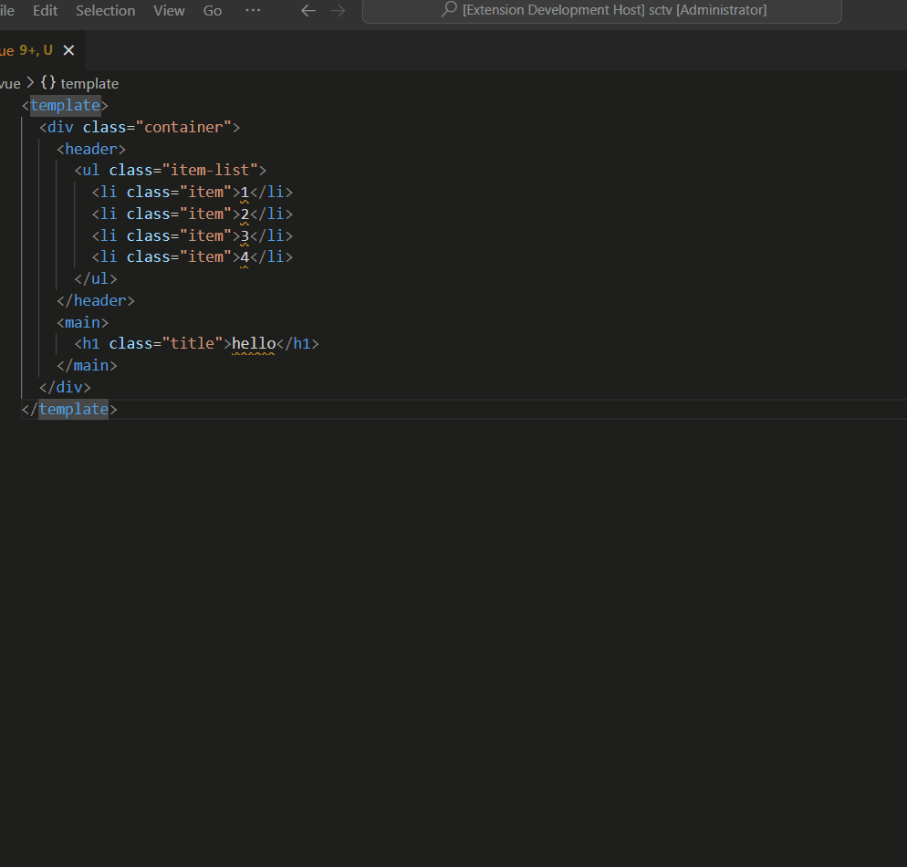

# Vue Nested CSS Generator

## Motivation

When developing Vue applications, it's common to face the challenge of writing CSS code that matches the structure of the template. Manually writing the CSS code can be time-consuming and error-prone. This VSCode plugin is designed to make this process easier by automatically generating the CSS code based on the structure of the template.

## Usage

You can use the following three methods to generate css:

1. Right-click in the active editor and select the "generate nested css" from the context menu.
2. Open the Command Palette (press Ctrl + Shift + P on Windows, Cmd + Shift + P on macOS) and type "generate nested css" in the input field. Select the "Vue CSS Generator: generate nested css" command from the suggestions.
3. Configure a keyboard shortcut: Go to File > Preferences > Keyboard Shortcuts, find command "vue-nested-css-generator.generate"

## Explanation

The Vue CSS Generator is a VSCode plugin that analyzes the Vue template and generates corresponding nested CSS code based on the DOM element structure. The plugin takes into account the tag and class of each DOM element and generates CSS code that matches the structure of the template. Users can also configure the plugin to ignore DOM elements without a class.

## Configuration

|key|default|description|
|--|--|--|
|`vncg.ingnoreTag`|`false`|Indicates whether the plugin should ignore DOM elements without a class when generating CSS code.|
|`vncg.openingTag`|``|Specifies the opening tag to be used to wrap the generated CSS code.|

## License

[MIT](./LICENSE) License © 2022 [kkopite](https://github.com/action-hong)
